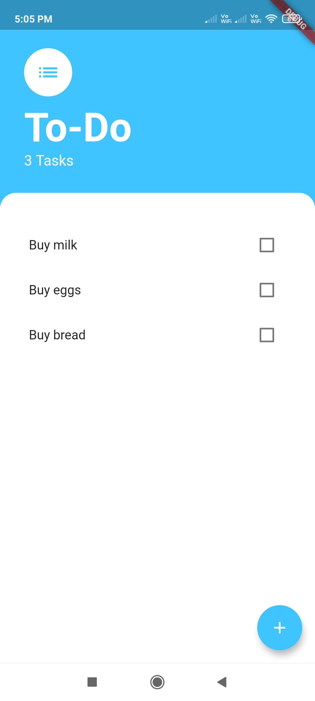
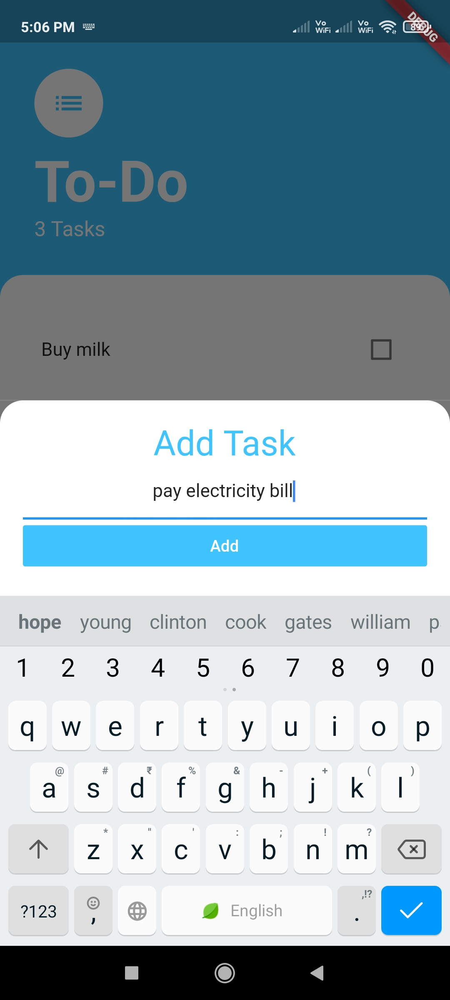
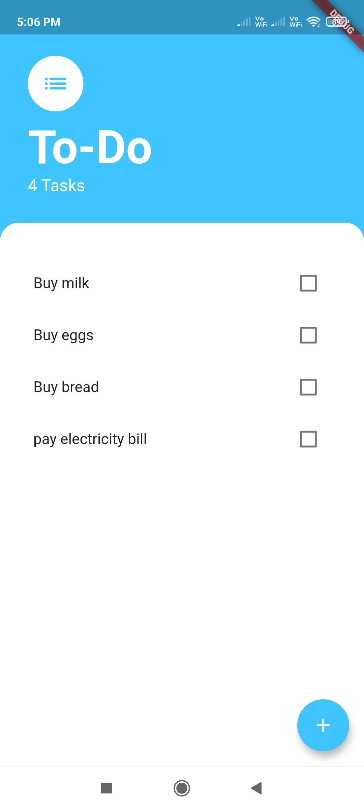
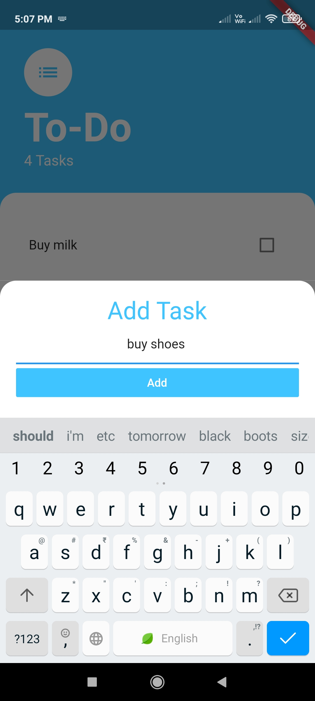
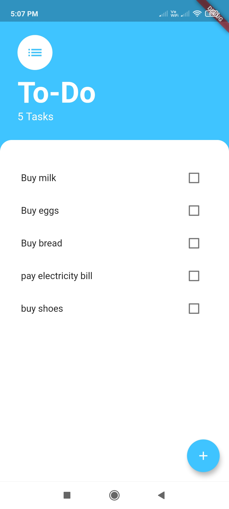
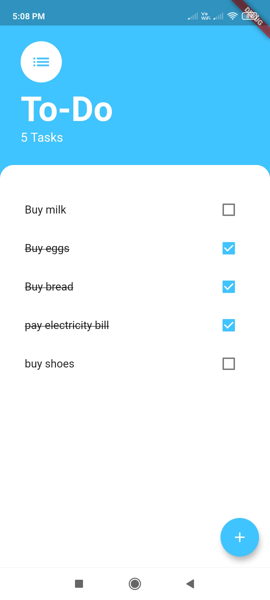

# To-Do App

## This is a to do app

## To-Do App UI:

### Main Page UI:

  

### Adding task in todo list:

  
  

### Result page of task added in todo list:

  

### Adding more task in todo list:

  
  

### Unmarking complete task in todo list:

  

